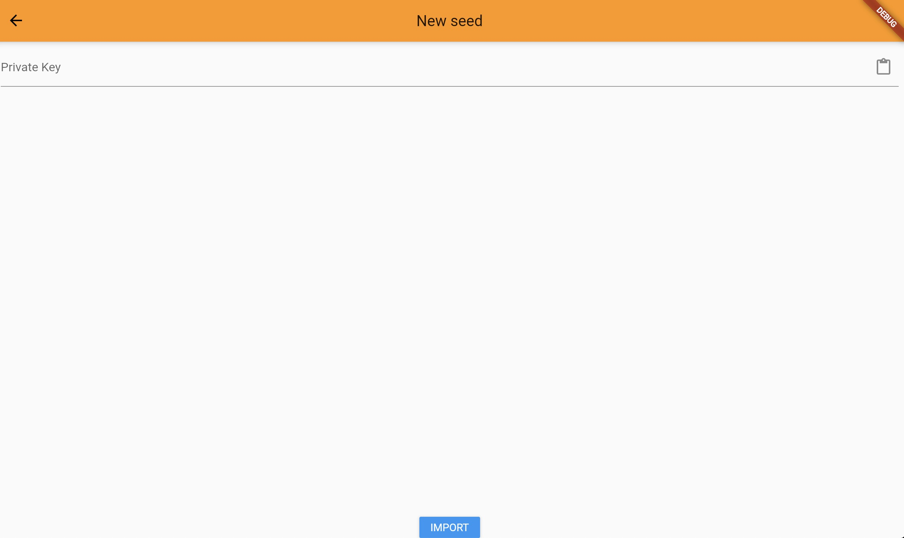

### Algorand Flutter
This is a demo project for Algorand Flutter Mobile Application.

### Build

You can run the application with the following command. 

```bash
flutter run
```


You can list the connected devices with the following command: 

```bash
flutter devices
```

You can run the application according to a particular devices. (You have to copy the device id)

```bash
flutter run -d chrome [device id]
```

To update your dependencies, please use: 

```bash
flutter pub get
```

To learn dependencies in a Flutter Project

```bash
flutter pub deps
``` 

Result is: 

```bash
Dart SDK 2.13.0-116.0.dev
Flutter SDK 2.1.0-12.1.pre
algorand_flutter 1.0.0+1
|-- algo_explorer_api 0.0.0
|   |-- built_collection 4.3.2
|   |   |-- collection...
|   |   '-- quiver...
|   |-- built_value 7.0.9
|   |   |-- built_collection...
|   |   |-- collection...
|   |   |-- fixnum 0.10.11
|   |   '-- quiver...
|   '-- dio 3.0.9
|       |-- http_parser...
|       '-- path...
|-- barcode_scan 2.0.1
|   '-- flutter...
|-- build_runner 1.7.4
|   |-- args 1.5.2
|   |-- async...
|   |-- build...
|   |-- build_config...
|   |-- build_daemon 2.1.3
|   |   |-- built_collection...
|   |   |-- built_value...
|   |   |-- http_multi_server...
|   |   |-- logging...
|   |   |-- package_resolver 1.0.10
|   |   |   |-- collection...
|   |   |   |-- http...
|   |   |   |-- package_config...
|   |   |   '-- path...
|   |   |-- path...
|   |   |-- pedantic...
|   |   |-- pool...
|   |   |-- shelf...
|   |   |-- shelf_web_socket...
|   |   |-- stream_transform...
|   |   |-- watcher...
|   |   '-- web_socket_channel...
|   |-- build_resolvers 1.3.3
|   |   |-- analyzer...
|   |   |-- build...
|   |   |-- crypto...
|   |   |-- graphs...
|   |   |-- logging...
|   |   |-- package_resolver...
|   |   |-- path...
|   |   '-- yaml...
|   |-- build_runner_core 4.4.0
|   |   |-- async...
|   |   |-- build...
|   |   |-- build_config...
|   |   |-- build_resolvers...
|   |   |-- collection...
|   |   |-- convert...
|   |   |-- crypto...
|   |   |-- glob...
|   |   |-- graphs...
|   |   |-- json_annotation...
|   |   |-- logging...
|   |   |-- meta...
|   |   |-- path...
|   |   |-- pedantic...
|   |   |-- pool...
|   |   |-- timing...
|   |   |-- watcher...
|   |   '-- yaml...
|   |-- code_builder 3.2.1
|   |   |-- built_collection...
|   |   |-- built_value...
|   |   |-- collection...
|   |   |-- matcher...
|   |   '-- meta...
|   |-- collection...
|   |-- crypto 2.1.3
|   |   |-- collection...
|   |   |-- convert...
|   |   '-- typed_data...
|   |-- dart_style 1.3.3
|   |   |-- analyzer...
|   |   |-- args...
|   |   |-- path...
|   |   '-- source_span...
|   |-- glob 1.2.0
|   |   |-- async...
|   |   |-- collection...
|   |   |-- node_io 1.0.1+2
|   |   |   |-- node_interop 1.0.3
|   |   |   |   '-- js...
|   |   |   '-- path...
|   |   |-- path...
|   |   |-- pedantic...
|   |   '-- string_scanner...
|   |-- graphs 0.2.0
|   |-- http_multi_server 2.2.0
|   |   '-- async...
|   |-- io 0.3.3
|   |   |-- charcode...
|   |   |-- meta...
|   |   |-- path...
|   |   '-- string_scanner...
|   |-- js 0.6.3
|   |-- logging...
|   |-- meta...
|   |-- mime...
|   |-- path...
|   |-- pedantic...
|   |-- pool 1.4.0
|   |   |-- async...
|   |   '-- stack_trace...
|   |-- pub_semver 1.4.3
|   |   '-- collection...
|   |-- pubspec_parse 0.1.5
|   |   |-- checked_yaml...
|   |   |-- json_annotation...
|   |   |-- pub_semver...
|   |   '-- yaml...
|   |-- shelf 0.7.5
|   |   |-- async...
|   |   |-- collection...
|   |   |-- http_parser...
|   |   |-- path...
|   |   |-- stack_trace...
|   |   '-- stream_channel...
|   |-- shelf_web_socket 0.2.3
|   |   |-- shelf...
|   |   |-- stream_channel...
|   |   '-- web_socket_channel...
|   |-- stack_trace 1.10.0
|   |   '-- path...
|   |-- stream_transform 1.2.0
|   |-- timing 0.1.1+2
|   |   '-- json_annotation...
|   |-- watcher 0.9.7+13
|   |   |-- async...
|   |   |-- path...
|   |   '-- pedantic...
|   |-- web_socket_channel 1.1.0
|   |   |-- async...
|   |   |-- crypto...
|   |   '-- stream_channel...
|   '-- yaml 2.2.0
|       |-- charcode...
|       |-- collection...
|       |-- source_span...
|       '-- string_scanner...
|-- cupertino_icons 0.1.3
|-- dart_algorand 0.0.0
|   |-- base32 1.1.1
|   |   '-- convert...
|   |-- built_collection...
|   |-- built_value...
|   |-- collection...
|   |-- dio...
|   |-- msgpack_dart 0.0.6
|   |-- pinenacl 0.1.2
|   |   |-- bech32 0.1.2
|   |   |   '-- convert...
|   |   |-- convert...
|   |   '-- fixnum...
|   '-- pointycastle...
|-- equatable 1.1.0
|   |-- collection...
|   '-- meta...
|-- firebase_core 0.5.3
|   |-- firebase_core_platform_interface 2.1.0
|   |   |-- flutter...
|   |   |-- meta...
|   |   |-- plugin_platform_interface...
|   |   '-- quiver...
|   |-- firebase_core_web 0.2.1+1
|   |   |-- firebase_core_platform_interface...
|   |   |-- flutter...
|   |   |-- flutter_web_plugins...
|   |   |-- js...
|   |   '-- meta...
|   |-- flutter...
|   |-- meta...
|   '-- quiver 2.0.5
|       |-- matcher...
|       '-- meta...
|-- firebase_dynamic_links 0.6.3
|   |-- firebase_core...
|   '-- flutter...
|-- flutter 0.0.0
|   |-- characters 1.1.0
|   |-- collection 1.15.0
|   |-- meta 1.3.0
|   |-- sky_engine 0.0.99
|   |-- typed_data 1.3.0
|   |   '-- collection...
|   '-- vector_math 2.1.0
|-- flutter_bloc 3.2.0
|   |-- bloc 3.0.0
|   |   |-- meta...
|   |   '-- rxdart...
|   |-- flutter...
|   '-- provider 4.0.4
|       |-- collection...
|       |-- flutter...
|       '-- nested 0.0.4
|           '-- flutter...
|-- flutter_dotenv 2.1.0
|   |-- flutter...
|   '-- meta...
|-- flutter_test 0.0.0
|   |-- async...
|   |-- boolean_selector 2.1.0
|   |   |-- source_span...
|   |   '-- string_scanner...
|   |-- characters...
|   |-- charcode 1.2.0
|   |-- clock 1.1.0
|   |-- collection...
|   |-- fake_async 1.2.0
|   |   |-- clock...
|   |   '-- collection...
|   |-- flutter...
|   |-- matcher 0.12.10
|   |   '-- stack_trace...
|   |-- meta...
|   |-- path...
|   |-- source_span 1.8.1
|   |   |-- collection...
|   |   |-- path...
|   |   '-- term_glyph...
|   |-- stack_trace...
|   |-- stream_channel 2.1.0
|   |   '-- async...
|   |-- string_scanner 1.1.0
|   |   |-- charcode...
|   |   '-- source_span...
|   |-- term_glyph 1.2.0
|   |-- test_api 0.2.19
|   |   |-- async...
|   |   |-- boolean_selector...
|   |   |-- collection...
|   |   |-- matcher...
|   |   |-- meta...
|   |   |-- path...
|   |   |-- source_span...
|   |   |-- stack_trace...
|   |   |-- stream_channel...
|   |   |-- string_scanner...
|   |   '-- term_glyph...
|   |-- typed_data...
|   '-- vector_math...
|-- freezed 0.7.3
|   |-- analyzer 0.39.4
|   |   |-- _fe_analyzer_shared 1.0.3
|   |   |   '-- meta...
|   |   |-- args...
|   |   |-- charcode...
|   |   |-- collection...
|   |   |-- convert...
|   |   |-- crypto...
|   |   |-- glob...
|   |   |-- html 0.14.0+3
|   |   |   |-- csslib 0.16.1
|   |   |   |   '-- source_span...
|   |   |   '-- source_span...
|   |   |-- meta...
|   |   |-- package_config 1.9.1
|   |   |   |-- charcode...
|   |   |   '-- path...
|   |   |-- path...
|   |   |-- pub_semver...
|   |   |-- source_span...
|   |   |-- watcher...
|   |   '-- yaml...
|   |-- build 1.2.2
|   |   |-- analyzer...
|   |   |-- async...
|   |   |-- convert...
|   |   |-- crypto...
|   |   |-- glob...
|   |   |-- logging...
|   |   |-- meta...
|   |   '-- path...
|   |-- build_config 0.4.2
|   |   |-- checked_yaml 1.0.2
|   |   |   |-- json_annotation...
|   |   |   |-- source_span...
|   |   |   '-- yaml...
|   |   |-- json_annotation...
|   |   |-- meta...
|   |   |-- path...
|   |   |-- pubspec_parse...
|   |   '-- yaml...
|   |-- freezed_annotation...
|   |-- meta...
|   '-- source_gen 0.9.5
|       |-- analyzer...
|       |-- async...
|       |-- build...
|       |-- dart_style...
|       |-- glob...
|       |-- meta...
|       |-- path...
|       |-- pedantic...
|       '-- source_span...
|-- freezed_annotation 0.7.1
|   |-- collection...
|   |-- json_annotation 3.0.1
|   '-- meta...
|-- http 0.12.2
|   |-- http_parser 3.1.3
|   |   |-- charcode...
|   |   |-- collection...
|   |   |-- source_span...
|   |   |-- string_scanner...
|   |   '-- typed_data...
|   |-- path 1.8.0
|   '-- pedantic...
|-- logger 0.9.4
|-- logging 0.11.4
|-- manta_dart 0.0.3
|   |-- asn1lib 0.5.15
|   |-- async 2.5.0
|   |   '-- collection...
|   |-- decimal 0.3.5
|   |   '-- rational 0.3.8
|   |-- json_annotation...
|   |-- logging...
|   |-- mqtt_client 5.6.3
|   |   |-- crypto...
|   |   |-- event_bus 1.1.1
|   |   |-- meta...
|   |   |-- path...
|   |   '-- typed_data...
|   |-- pointycastle 1.0.2
|   |-- rsa_pkcs 1.1.0
|   |   '-- asn1lib...
|   '-- uuid 1.0.3
|       |-- convert 2.1.1
|       |   |-- charcode...
|       |   '-- typed_data...
|       '-- crypto...
|-- pedantic 1.8.0+1
|-- qr_flutter 3.2.0
|   |-- flutter...
|   '-- qr 1.2.0
|       '-- meta...
|-- rxdart 0.23.1
|-- share 0.6.5+4
|   |-- flutter...
|   |-- meta...
|   '-- mime 0.9.7
|-- shared_preferences 0.5.12+4
|   |-- flutter...
|   |-- meta...
|   |-- shared_preferences_linux 0.0.2+4
|   |   |-- file 5.2.1
|   |   |   |-- intl 0.16.1
|   |   |   |   '-- path...
|   |   |   |-- meta...
|   |   |   '-- path...
|   |   |-- flutter...
|   |   |-- meta...
|   |   |-- path...
|   |   |-- path_provider_linux 0.0.1+2
|   |   |   |-- flutter...
|   |   |   |-- path...
|   |   |   |-- path_provider_platform_interface...
|   |   |   '-- xdg_directories 0.1.2
|   |   |       |-- meta...
|   |   |       |-- path...
|   |   |       '-- process 3.0.13
|   |   |           |-- file...
|   |   |           |-- intl...
|   |   |           |-- meta...
|   |   |           |-- path...
|   |   |           '-- platform...
|   |   '-- shared_preferences_platform_interface...
|   |-- shared_preferences_macos 0.0.1+6
|   |   |-- flutter...
|   |   '-- shared_preferences_platform_interface...
|   |-- shared_preferences_platform_interface 1.0.3
|   |   |-- flutter...
|   |   '-- meta...
|   |-- shared_preferences_web 0.1.2+4
|   |   |-- flutter...
|   |   |-- flutter_web_plugins 0.0.0
|   |   |   |-- characters...
|   |   |   |-- collection...
|   |   |   |-- flutter...
|   |   |   |-- js...
|   |   |   |-- meta...
|   |   |   |-- typed_data...
|   |   |   '-- vector_math...
|   |   |-- meta...
|   |   '-- shared_preferences_platform_interface...
|   '-- shared_preferences_windows 0.0.1+3
|       |-- ffi 0.1.3
|       |-- file...
|       |-- flutter...
|       |-- meta...
|       |-- path...
|       |-- path_provider_platform_interface 1.0.4
|       |   |-- flutter...
|       |   |-- meta...
|       |   |-- platform 2.2.1
|       |   '-- plugin_platform_interface...
|       |-- path_provider_windows 0.0.4+3
|       |   |-- ffi...
|       |   |-- flutter...
|       |   |-- meta...
|       |   |-- path...
|       |   |-- path_provider_platform_interface...
|       |   '-- win32 1.7.4
|       |       '-- ffi...
|       '-- shared_preferences_platform_interface...
'-- url_launcher 5.4.2
    |-- flutter...
    |-- url_launcher_macos 0.0.1+4
    |   '-- flutter...
    |-- url_launcher_platform_interface 1.0.6
    |   |-- flutter...
    |   |-- meta...
    |   '-- plugin_platform_interface 1.0.2
    |       '-- meta...
    '-- url_launcher_web 0.1.1+1
        |-- flutter...
        |-- flutter_web_plugins...
        |-- meta...
        '-- url_launcher_platform_interface...

```

Screenshots from the application (Chrome Browser sample): 




